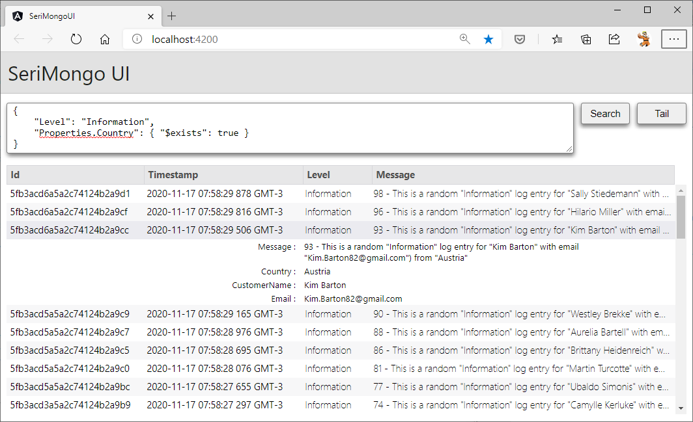

# SeriMongo

A simple log viewer for [serilog-sinks-mongodb](https://github.com/serilog/serilog-sinks-mongodb).

## Features

* See your logs in real-time with [SignalR](https://docs.microsoft.com/pt-br/aspnet/core/signalr/introduction?view=aspnetcore-5.0) and [MongoDB Change Streams](https://docs.mongodb.com/manual/changeStreams/).
* You can type MongoDB filter documents into the search bar to display only log entries which match the specified criteria. 

## Screenshot

