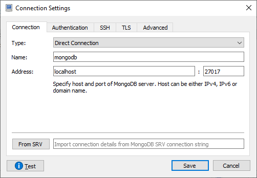
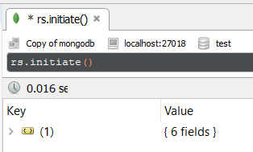
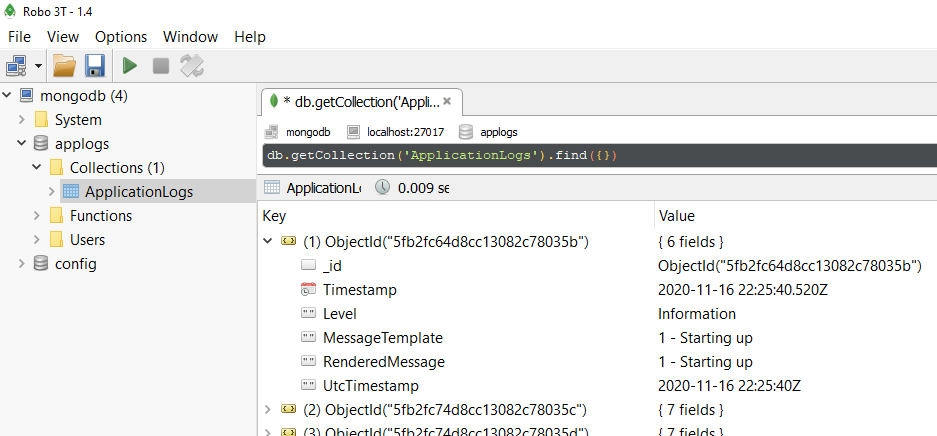

# SeriMongo

A simple log viewer for [serilog-sinks-mongodb](https://github.com/serilog/serilog-sinks-mongodb).

## Features

* See your logs in real-time with [SignalR](https://docs.microsoft.com/pt-br/aspnet/core/signalr/introduction?view=aspnetcore-5.0) and [MongoDB Change Streams](https://docs.mongodb.com/manual/changeStreams/).
* You can type MongoDB filter documents into the search bar to display only log entries which match the specified criteria. 

## Screenshot


## Instructions

### Install and Configure MongoDB

To test this easily in docker desktop.

#### First, create a volume

```
docker volume create --name=mongodata
```

#### Create an image, configuring it to use a replica set:

```
docker run --name mongodb2 -v mongodata2:/data/db -d -p 27017:27017 mongo --replSet rs0 --oplogSize 50
```

> SeriMongo works with a single MongoDB instance because all we are interested is in the oplog.

#### Initiate the replica set:

You can use a GUI tool like RoboMongo or the Mongo shell.

**Mongo Shell**

Connect to the console of the running docker image:

```
docker exec -it mongodb bash
root@61ea9d5e1425:/# mongo
> rs.initiate()
```

The above command result will be:

```
> rs.initiate()
{
        "info2" : "no configuration specified. Using a default configuration for the set",
        "me" : "fe153506a3b2:27017",
        "ok" : 1,
        "$clusterTime" : {
                "clusterTime" : Timestamp(1605713394, 1),
                "signature" : {
                        "hash" : BinData(0,"AAAAAAAAAAAAAAAAAAAAAAAAAAA="),
                        "keyId" : NumberLong(0)
                }
        },
        "operationTime" : Timestamp(1605713394, 1)
}
rs0:SECONDARY>
```

**GUI (Robo3T)**

Connect to MongoDB instance running in docker:



Then run:



### Configure and Run the Sample Application

Configure the connection in appsettings.json:

```json
{
  "AllowedHosts": "*",
  "ConnectionStrings": {
    "BaseLog": "mongodb://localhost:27017/applogs"
  },
```

Run the application, it will create the database and hte collection.

You can now see your logs in Robot3T for example:




### Configure adnd Run SeriMongo 

Configure the connection in appsettings.json:

```json
  "ApplicationOptions": {
    "ConnectionInfo": {
      "ConnectionString": "mongodb://localhost:27017",
      "DatabaseName": "applogs",
      "CollectionName": "ApplicationLogs"
    }
  }
}
```

## Sample Queries

Here you can see some sample queries and how SeriMongo displays its results.

### Filter by Timestamp

You can enter dates in ISO format:

```json
{
  "Timestamp": {
    "$gte": "2020-11-16T07:58:29.924-03:00",
    "$lte": "2020-11-17T07:58:30.221-03:00"
  }
}
```

Note that the backend will convert the timestamp to `ISODate("date-value")` syntax. The above query, in Robo 3T or Mongo shell, would be written like this:

```json
{
  "Timestamp": {
    "$gte": ISODate("2020-11-17T07:58:29.924-03:00"),
    "$lte": ISODate("2020-11-17T07:58:30.221-03:00")
  }
}
```

### Filter by Multiple Criteria (AND)

To filter for example by log level and tiestamp, use the comma `,`, like in:

```json
{
  "Level": "Error",
  "Timestamp": {
    "$gte": "2020-11-16T07:58:29.924-03:00",
    "$lte": "2020-11-17T07:58:30.221-03:00"
  }
}
```

### Filter by Multiple Criteria (IN)

To filter for example by more than one log level at the same time, use the `"$in"` syntax:

```json
{ "Level": { "$in": [ "Error", "Warning" ] } }
```

### Filter by Multiple Criteria (OR)

To filter by one set of criteria or another, use the `"$or"` syntax:

```json
{
  "$or":
  [
    {
      "Level": "Information"
    }, 
    {
      "Level" : "Debug"
    }
  ]
}
```

### Filter by Sub Documents

This allows you to filter by properties created dynamically by .NET Core logging scopes and message templates.

Returns log entries that have a property with any value:

```json
{
  "Properties.CustomerName": { "$exists": true }
}
```

Returns log entries that have properties with a specific value:

```json
{
  "Properties.Country": "Austria"
} 
```

---
