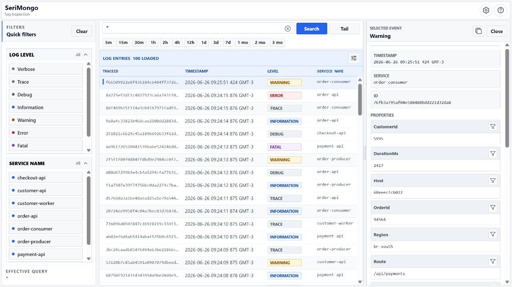
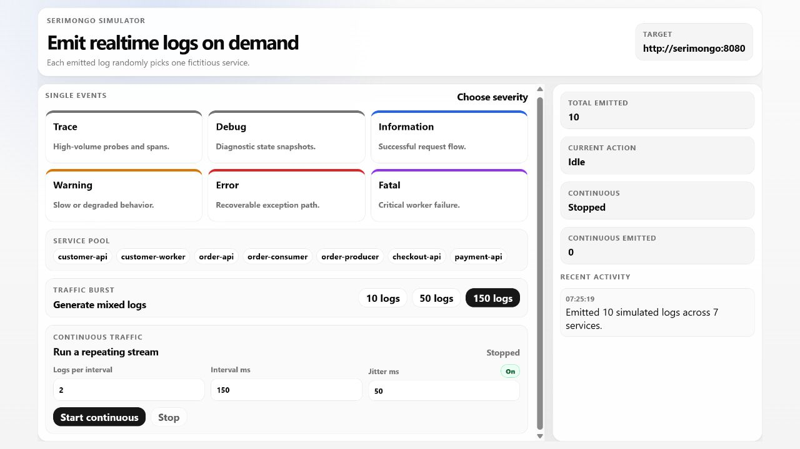

# SeriMongo

SeriMongo is a real-time log viewer backed by SQLite. It receives logs through HTTP APIs, broadcasts new entries to the UI with SignalR, and supports OTLP/HTTP JSON log ingestion.

## Screenshots

### Log viewer

Search, filter, tail, and inspect structured log events from the same workspace.



### Realtime simulator

Generate individual events, mixed bursts, or continuous traffic from the bundled simulator.



## Features

* SQLite storage.
* Real-time UI updates through SignalR.
* LogQL search dialect compiled to parameterized SQLite queries.
* OTLP logs receiver at `/v1/logs` and `/otlp/v1/logs` for `http/json` exporters.
* Docker image with Angular UI and ASP.NET Core backend.
* Docker Compose simulator UI for emitting realtime sample logs.

## Run With Docker

Build the image:

```bash
docker build -t serimongo:local .
```

Run it:

```bash
docker run --rm -p 51983:8080 -v serimongo-data:/data serimongo:local
```

Run it with the bundled `seed.sql` enabled:

```bash
docker run --rm -p 51983:8080 \
  -e ApplicationOptions__Seed__Enabled=true \
  -e ApplicationOptions__Seed__ScriptPath=/app/seed.sql \
  -v serimongo-data:/data \
  serimongo:local
```

Or use Docker Compose, which enables the seed by default:

```bash
docker compose up --build
```

Open the UI:

```text
http://localhost:51983
```

Open the simulator UI and click a severity button to send logs to SeriMongo:

```text
http://localhost:51984
```

The container stores SQLite data at `/data/serimongo.db`. Override it with:

```bash
docker run --rm -p 51983:8080 \
  -e ApplicationOptions__Database__ConnectionString="Data Source=/data/custom.db" \
  -v serimongo-data:/data \
  serimongo:local
```

## Seed Data

The Docker image includes `seed.sql`, a compact SQLite script that generates 3000 varied log entries. Startup seeding runs only when both conditions are met:

* `ApplicationOptions__Seed__Enabled=true`
* the configured `ApplicationOptions__Seed__ScriptPath` file exists

The bundled script is idempotent: it inserts only when `LogEntries` is empty, so restarts do not duplicate seed data.

## Simulator

The simulator is a separate ASP.NET Core + Angular app in `Simulator/SeriMongo.Simulator`. Docker Compose runs it on port `51984` and configures it to post OTLP/HTTP JSON logs to the main `serimongo` service.

Configure a different target with:

```text
SimulatorOptions__TargetBaseUrl=http://localhost:51983
```

The UI can emit one log for each supported level or generate mixed bursts of sample traffic.

## LogQL

The search box accepts LogQL expressions. Values are always passed to SQLite as parameters; only known log fields and sanitized `prop.<name>` paths are converted to SQL.

Fields:

* `id`
* `timestamp`
* `level`
* `message`
* `exception`
* `prop.<name>` for structured properties

Operators:

* `=`, `!=`, `>`, `>=`, `<`, `<=`
* `contains`, `startswith`, `endswith`
* `in (...)`
* `exists`
* `and`, `or`, parentheses

Examples:

```text
*
level = Error
level in (Error, Warning) and timestamp >= "2026-01-01T00:00:00Z"
message contains "checkout failed"
exception exists
prop.CustomerId = 42 or prop.Country = "Brazil"
```

The dialect metadata is also available at:

```text
GET /api/search/dialect
```

## HTTP Log Ingestion

Insert a log directly:

```bash
curl -X POST http://localhost:51983/api/applogs \
  -H "Content-Type: application/json" \
  -d '{
    "level": "Error",
    "renderedMessage": "checkout failed",
    "properties": { "CustomerId": 42, "Country": "Brazil" }
  }'
```

Search logs:

```bash
curl -X POST "http://localhost:51983/api/search?currentPage=1&pageSize=100" \
  -H "Content-Type: application/json" \
  -d '{ "query": "level = Error and prop.CustomerId = 42" }'
```

## OTLP Logs

The receiver supports OTLP/HTTP JSON. Configure OpenTelemetry exporters with:

```text
OTEL_EXPORTER_OTLP_ENDPOINT=http://localhost:51983
OTEL_EXPORTER_OTLP_PROTOCOL=http/json
```

Send a minimal OTLP JSON payload:

```bash
curl -X POST http://localhost:51983/v1/logs \
  -H "Content-Type: application/json" \
  -d '{
    "resourceLogs": [
      {
        "resource": {
          "attributes": [
            { "key": "service.name", "value": { "stringValue": "checkout-api" } }
          ]
        },
        "scopeLogs": [
          {
            "scope": { "name": "sample" },
            "logRecords": [
              {
                "severityText": "ERROR",
                "body": { "stringValue": "checkout failed" },
                "attributes": [
                  { "key": "CustomerId", "value": { "intValue": "42" } }
                ]
              }
            ]
          }
        ]
      }
    ]
  }'
```

## Local Development

Backend:

```bash
dotnet build SeriMongo/SeriMongo.csproj
dotnet run --project SeriMongo/SeriMongo.csproj --urls http://localhost:51983
```

Frontend with Angular 22 requires Node 22.22.3+, Node 24.15.0+, or newer. If your local Node is older, use Docker/Node 24 for frontend commands:

```bash
docker run --rm --mount "type=bind,source=%CD%/SeriMongo,target=/app" -w /app node:24-alpine npm run build
```
